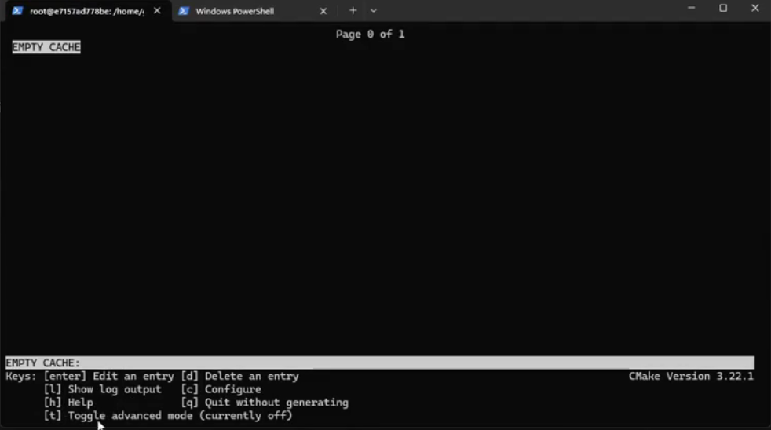

## CMake笔记

> This directory contains source code examples for the CMake Tutorial.
> Each step has its own subdirectory containing code that may be used as a
> starting point. The tutorial examples are progressive so that each step
> provides the complete solution for the previous step.

CMake并不是一个单一的工具，而是一个工具集，我们日常编译代码使用的最多的cmake只是其中的一个工具，其具体包括：cmake、ctest、cpack、cmake-hui和ccmake。

* cmake：用于构建程序的第一步，进行项目的配置、生成和构建项目的主要可执行文件

* ctest：运行和报告测试结构的测试驱动程序
* cpack：用来生成安装程序和源包的打包程序;;;;;
* cmake-gui：CMake的图形界面
* ccmake：也用于图形界面，与cmake-gui不同的是ccmake是基于控制台terminal的图形界面




### 1. cmake的工作流程

cmake的工作流程分为三个阶段：配置、生成、构建


### 2. CMake基本语法

#### 2.1 变量

在CMake中，变量分为三类：环境变量、缓存变量和普通变量。

* **环境变量**

  整个CMake进程的作用域都可用，但不会影响CMake进程外的整个环境系统，也就是说可以在一个脚本中定义一个环境变量，然后在配置cmake时调用。

  ​	环境变量的定义方法为：

  `set(ENV{<variable>} <value>)`

  ​	清楚环境变量的方法为：

  `unset(ENV{<variable>})`

  ​	其中`ENV`表示环境变量标志性前缀，`variable`指变量名称，`value`则为变量值，值得注意的是，**设定或读取环境变量时，都通过ENV前缀来访问环境变量，读取环境变量值时，要在ENV前加$符号；但if判断是否定义时，不用加$符号。**

  ```cmake
   1、 # 示例1：
   2、 set(ENV{CXX} "clang++")
   3、 unset(ENV{VERBOSE})
   4、  
   5、 # 示例2：
   6、 set(ENV{CMAKE_PATH} "myown/path/example")
   7、 # 判断CMAKE_PATH环境变量是否定义
   8、 if(DEFINED ENV{CMAKE_PATH}) # 注意此处ENV前没有$符号
   9、   message("CMAKE_PATH_1: $ENV{CMAKE_PATH}") # 注意此处ENV前有$符号
   10、else()
   11、  message("NOT DEFINED CMAKE_PATH VARIABLES")
   12、endif()
  ```

  ​	还有就是，定义的环境变量在CMake进程启动后会基于CMake在配置阶段中收集的信息在CMake生成阶段（生成makefile）生成环境变量的副本，所以若使用环境变量作为指令的参数，这些值将在CMake生成构建系统期间（配置和生成makefile的阶段）插入，并且会嵌入到构建树中，所以在构建系统生成后，即使再通过脚本修改环境变量的值，对已完成构建的系统，该环境变量的值也不会发生更新或改变。实例如下：

  ```cmake
   13、 # 示例3:当前CMakeLists.txt:
   14、 
   15、 cmake_minimum_required(VERSION 3.20.0)
   16、 project(Environment)
   17、 # 在配置期间打印myenv环境变量
   18、 message("generated with " $ENV{myenv})
   19、 # 在构建阶段过程中打印相同的变量
   20、 add_custom_target(EchoEnv ALL COMMAND echo "myenv in build is" $ENV{myenv})
  ```

  ​	示例3的CMakeLists.txt中是有两个展示环境变量的阶段：第一将在配置期间打印myenv环境变量并通过add_custom_target() 添加一个构建阶段，第二将在构建阶段过程中打印相同的变量。

  ```shell
   22、 # 示例4:bash脚本
   23、 
   24、 # 先定义myenv环境变量，并打印
   25、 export myenv=first
   26、 echo myenv is now $myenv
   27、 # 基于CMakeList.txt生成一个构建系统
   28、 cmake -B build .
   29、 cd build
   30、 # 基修改myenv环境变量，并打印
   31、 export myenv=second
   32、 echo myenv is now $myenv
   33、 # 开始构建
   34、 cmake --build .
  ```

  > `cmake -B build . `：在当前目录的 `build` 子目录中生成构建文件，为后续编译做准备。
  >
  > * **`-B build`**：指定构建目录为 `build`。CMake 会在该目录下生成构建文件
  > * **`.`**：指定源目录为当前目录。CMake 会在当前目录中查找 `CMakeLists.txt` 文件。
  >
  > `cmake --build .`：在当前目录中执行构建操作，编译生成目标文件
  >
  > * **`--build`**：告诉 CMake 执行构建操作，而不是配置或生成构建文件。
  > * **`.`**：指定构建目录为当前目录。CMake 会在当前目录中查找之前生成的构建文件，如makefile

  运行示例4中的代码：

  ```shell
  1. $ ./build.sh | grep -v "\-\-"
  2. myenv is now first
  3. generated with first
  4. myenv is now second
  5. Scanning dependencies of target EchoEnv
  6. myenv in build is first
  7. Built target EchoEnv
  ```

* **缓存变量**：CMake进程在配置阶段收集相关信息后存储再构建树的CMakeCache.txt文件中的变量，缓存变量不能像环境变量那样在脚本中使用。缓存变脸（Cache Variable）相当于一个全局变量，在同一个CMake工程中任何地方都可以使用，如父目录、子目录等。

  ​	缓存变量的定义/修改方法为：

  `set(<variable><value>CACHE<type><docstring>[FORCE])`

  ​	其中`variable`指变量名称，`value`则为变量值，`CACHE`为缓存变量的标志，`type`为变量类型，分为BOOL、FILEPATH、PATH、STRING、INTERNAL。`docstring`为变量概要说明，必须是字符串，`FORCE`表示强制修改变量的值，在**定义缓存变量时**不加也能定义成功，但是**修改时**不加FORCE选项则修改无效，所以不论定义或修改缓存变量时，建议都加上FORCE选项。

  ```cmake
  1、 //设置一个string类型的缓存变量，名称为FOO，变量值为BAR
  2、 set(FOO "BAR" CACHE STRING "interesting value" FORCE)
  3、 //设置一个string类型的缓存变量，名称为CMAKE_BUILD_TYPE，变量值为Release
  4、 set(CMAKE_BUILD_TYPE Release CACHE STRING "Build type" FORCE)
  ```

* **普通变量**：普通变量的作用域仅限于当前 `CMakeLists.txt` 文件或其所在的代码块，普通变量不会存储在 CMake 的缓存中（即不会出现在 `CMakeCache.txt` 文件中）。

  ​	普通变量的定义方法为：

  `set(<variable><value>)`

​	总的来说，CMake不管是函数作用域还是CMake目录作用域，其都有两个特点：向下有效和数值拷贝生成副本，在不使用特殊关键字（FORCE）的情况下，如修改缓存变量的值，嵌套（子）作用域针对普通变量的修改不会影响到父作用域。针对变量，普通变量仅仅有效于当前作用域，而缓存变量和环境变量可以在全局作用域中使用。

#### 2.2 控制结构

* 条件块：必须以`if()`开头并以`endif()`结尾，在开头的`if()`和结尾的`endif()`之间可以添加任意数量的`elseif()`，但只能有单独一个的，可选的`else()`。

  ```cmake
   1、 if(<condition>)
   2、  <commands>
   3、 elseif(<condition>) # optional block, can be repeated
   4、  <commands>
   5、 else() # optional block
   6、  <commands>
   7、 endif()
  ```

* 循环：cmake的循环控制块有两种形式，一个是以`while()`开头创建并以`endwhile()`结尾的块状结构；另一个是更常用的`foreach()`循环控制块。

  ```cmake
   # 形式1
   1、 while(<condition>)
   2、  <commands>
   3、 endwhile()
   
   # 形式2
   1、 foreach(<loop_var> RANGE <min> <max> [<step>])
   2、  <commands>
   3、 endforeach()
   
   # 形式3
   1、foreach(<loop_variable> IN [LISTS <lists>] [ITEMS <items>])
   2、 <commands>
   3、endforeach()
  ```

  对于形式3，cmake将从所提供的`<lists>`列表中获取元素，也就是输入循环中的list可以是多个，然后是从所有显示申明的`<lists>`中获得元素值，并将它们存储在`<loop_variable>`中，可以选择只提供列表、只提供值或者俩者都提供。

  ```cmake
   # 形式3的应用
   1、 set(MY_LIST 1 2 3)
   2、 foreach(VAR IN LISTS MY_LIST ITEMS e f)
   3、  message(${VAR})
   4、 endforeach()
   
   # 执行结果
   1
   2
   3
   e
   f
  ```

  更简洁的版本：

  ```cmake
  foreach(VAR 1 2 3 e f)
  ```

  从cmake3.17开始，`foreach()`开始支持压缩列表：

  ```cmake
  1、 foreach(<loop_var>... IN ZIP_LISTS <lists>)
  ```

  在压缩列表中CMake 将为每个提供的列表创建一个`num_<N> `变量，用每个列表中的项填充该变量。同时，除了使用CMake自动创建的`num_<N> `变量，用户也可以自定义传递多个`<loop_var> `变量名(每个列表一个)，每个列表将使用单独的变量来存储:

  ```cmake
   1、 # 声明两个具有相同数量元素的list
   2、 set(L1 "one;two;three;four")
   3、 set(L2 "1;2;3;4;5")
   4、 # 通过ZIP_LISTS关键子来“压缩“上面的两个列表，以在单次循环中处理相同索引的列表元素
   5、 # 示例1：通过num_<N> 变量存储获取元素
   6、 foreach(num IN ZIP_LISTS L1 L2)
   7、  message("num_0=${num_0}, num_1=${num_1}")
   8、 endforeach()
   9、  
   10、 # 示例2：通过自定义传递两个<loop_var>变量，存储获取元素
   11、 foreach(word num IN ZIP_LISTS L1 L2)
   12、  message("word=${word}, num=${num}")
   13、 endforeach()
  ```

#### 2.3 自定义指令

CMake中的自定义指令的方法实现为两种：`macro()`和`function()`，对应c++中的宏定义和函数定义，需要关注宏定义中的作用域问题，**宏不会创建新的作用域**。

* macro()

```cmake
# 宏定义
macro(<name> [<argument> ])
	<commands>
endmacro()
```

```cmake
 1、 # 定义了一个名为MyMacro的宏，参数为myVar
 2、 macro(MyMacro myVar)
 3、  set(myVar "new value")
 4、  message("argument: ${myVar}")
 5、 endmacro()
 6、  
 7、 set(myVar "first value")
 8、 message("myVar is now: ${myVar}")
 9、 # 调用宏
 10、 MyMacro("called value")
 11、 message("myVar is now: ${myVar}")
```

​	运行示例1，可以得到：

```shell
myVar is now: first value
argument: called value
myVar is now: new value
```

​	上例中尽管调用MyMacro尝试显式地将myVar 设置为“new value”，**但后续message打印的${myVar}并不是“new value”，而是在第10行中传递给宏的参数${"called value"}**，也就是宏中对全局作用域中的myVar 变量的修改，并不影响宏中message(”argument:${myVar}”)，**这是因为传递给宏的参数没有视为真正的变量，而是作为常量查找并替换指令**。所以宏MyMacro中对全局作用域中的myVar 变量的修改行为，是一种副作用！上述的例子是CMake不提倡的一种实践方式，因为一旦变量作用域和宏作为“查找和替换指令”的行为未被正确使用，就会产生难以描述的负面影响。

**关键机制解释：**

a. **文本替换而非变量传递**：宏的参数在调用时会被直接替换到宏体中。例如，`MyMacro("called value")` 将宏体内的 `myVar` 替换为 `"called value"`。

b. **副作用产生原因**：当宏的参数名与全局变量同名时，宏内部对参数的修改实际上直接作用于全局变量。这是因为宏没有独立的作用域，其操作在调用者的作用域（此处为全局）中进行。

c. **参数替换的混淆**：`message("argument: ${myVar}")` 中的 `${myVar}` 在宏展开时被替换为参数值 `"called value"`，但 `set(myVar "new value")` 中的 `myVar` 因与全局变量同名，直接修改了全局变量。（难以理解）


* function()

```cmake
# CMake中的函数声明
function(<name> [<argument> ])
	<commands>
endfunction()
```

```cmake
 1、 //定义了一个名为MyFunction的函数，参数为FirstArg
 2、 function(MyFunction FirstArg)
 3、  message("Function: ${CMAKE_CURRENT_FUNCTION}")
 4、  message("File: ${CMAKE_CURRENT_FUNCTION_LIST_FILE}")
 5、  message("FirstArg: ${FirstArg}")
 6、  set(FirstArg "new value")
 7、  message("FirstArg again: ${FirstArg}")
 8、  message("ARGV0: ${ARGV0} ARGV1: ${ARGV1} ARGC: ${ARGC}")
 9、 endfunction()
 10、  
 11、 set(FirstArg "first value")
 12、 //调用函数，并传参个数比函数声明时的多了一个
 13、 MyFunction("Value1" "Value2")
 14、 message("FirstArg in global scope: ${FirstArg}"))
```

 ${ARGC}输出参数的数量、${ARGV}输出所有参数的列表、${ARG0}, ${ARG1}, ${ARG2}输出特定索引处的实参值、${ARGN}输出最后一个预期参数之后由调用者传递的匿名参数列表。运行可以得到：

```shell
1. Function: MyFunction
2. File: /root/examples/chapter02/08-definitions/function.cmake
3. FirstArg: Value1
4. FirstArg again: new value
5. ARGV0: Value1 ARGV1: Value2 ARGC: 2
6. FirstArg in global scope: first value
```

​	综上可知，第一，函数中对全局变量的修改只停留在函数作用域中，在函数结束后不会影响到父作用域中的变量value值。第二，传递给函数的实参值被真正使用在了函数的作用域内。CMake中的宏`macro()`和函数`function()`都是提供给用户以自定义指令的方法，只不过，CMake函数`function()`开放了自己的作用域（function scope），并可以在其作用域内安全的调用set()指令以提供函数的一个命名参数，任何更改都将是函数的局部更改(除非指定了PARENT_SCOPE)，不影响PARENT SCOPE。

#### 2.4 实用指令

* message()指令

在配置阶段将文本打印到标准输出，并且CMake通过提供Mode参数，可以自定义输出样式，再出现错误的情况下，可以停止代码。默认Mode是“status”。

```cmake
message(<mode> "text")
# 示例
message(FATAL_ERROR "First Message Printed")
message("Won't print this.")
```

mode类型：

| mode           | 作用                                                         |
| -------------- | ------------------------------------------------------------ |
| FATAL_ERROR    | 将停止处理和生成。                                           |
| WARNING        | 继续处理。                                                   |
| SEND_ERROR     | 将继续处理，但跳过生成。                                     |
| AUTHOR_WARNING | CMake 警告。继续处理。                                       |
| DEPRECATION    | 若启用了CMAKE_ERROR_DEPRECATED 或 CMAKE_WARN_DEPRECATED 变量，将做出相应处理。 |
| NOTICE         | 或省略模式(默认): 将向stderr 输出一条消息，以吸引用户的注意。 |
| STATUS         | 将继续处理，建议用于用户的主要消息。                         |
| VERBOSE        | 将继续处理，用于通常不是很有必要的更详细的信息。             |
| DEBUG          | 将继续处理，并包含在项目出现问题时可能有用的详细信息。       |
| TRACE          | 将继续处理，并建议在项目开发期间打印消息。通常，在发布项目之前，将这些类型的消息删除。 |

* include()指令

Modern CMake中重要的一个模块，可以引用已经配置好的CMake模板，所谓CMake模板，就是将CMake代码划分为单独的.cmake文件中，以保持内容的有序和独立。

```cmake
include(<file|module> [OPTIONAL] [RESULT_VARIABLE <var>])
```

若提供文件名(一个扩展名为.cmake)，CMake 将尝试打开并执行它。**这里不会创建嵌套的、单独的作用域，因此对该文件中变量的修改会影响调用作用域。**若文件不存在，CMake 将抛出一个错误。

* execute_process() 指令

除了CMake官方和自定义的指令外，有时需要使用系统中可用的工具，CMake 为此提供了`execute_process()`指令以用来运行其他进程，并收集它们的输出。这个命令非常适合脚本，也可以在配置阶段的项目中使用。

```cmake
execute_process(COMMAND <cmd1> [<arguments>]  [OPTIONS])
```


### 3. 简单的CMake构建

https://zhuanlan.zhihu.com/p/620839692


> 详细参考：【CMake Cookbook】https://www.bookstack.cn/read/CMake-Cookbook/content-preface-preface-chinese.md

